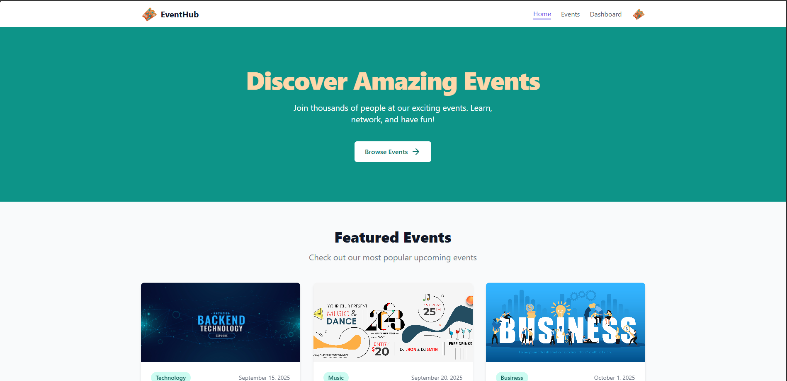
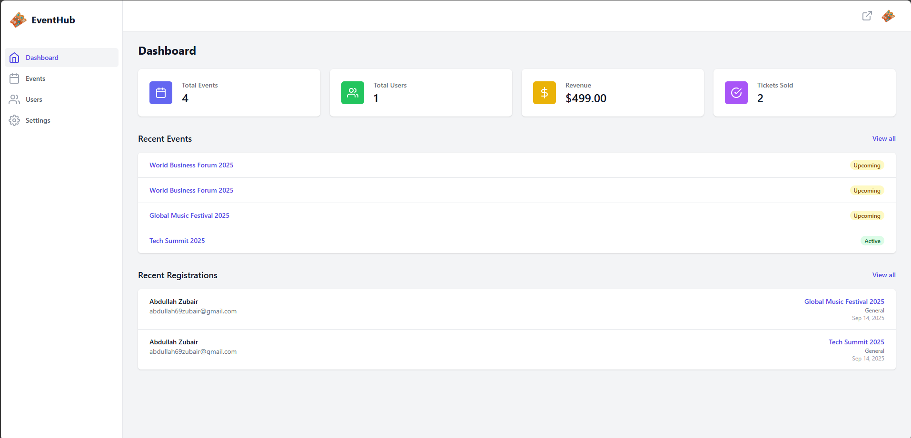
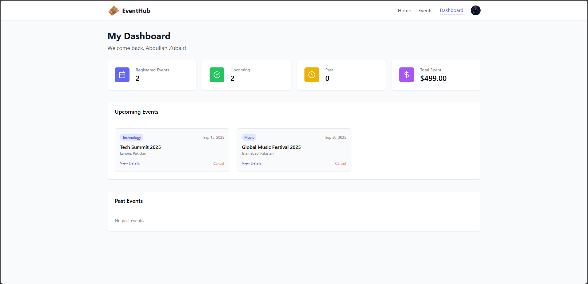
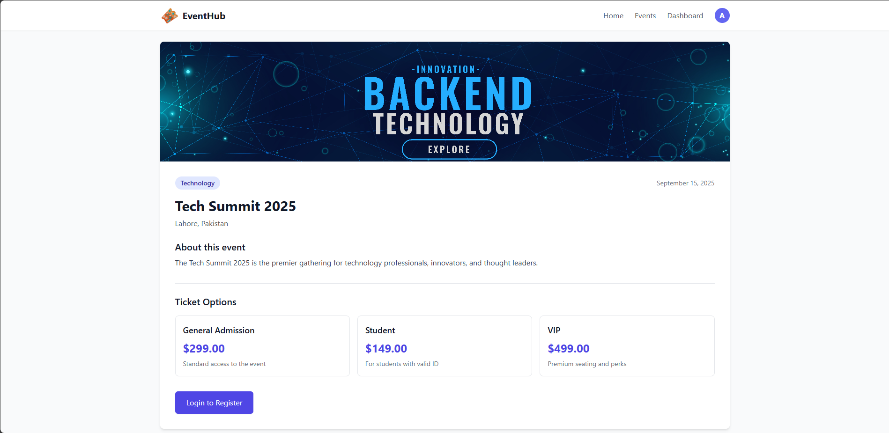

# 🎟️ EventHub - Event Management Platform

EventHub is a PHP + MySQL powered platform for managing events, users, and registrations.  
It comes with a **public event listing site** and a **full-featured admin dashboard** built with TailwindCSS.

---

## 📑 Table of Contents

- [Overview](#overview)  
- [Features](#features)  
- [Tech Stack](#tech-stack)  
- [Screenshots](#screenshots)  
- [Demo Accounts](#demo-accounts)  
- [Installation (XAMPP)](#installation-xampp)  
- [Configuration](#configuration)  
- [Security Features](#security-features)  
- [Contributing](#contributing)  
- [Author](#author)  
- [License](#license)  

---

## 📖 Overview

EventHub makes it easy to:

- Publish events with categories, pricing tiers, and images.  
- Register and manage users.  
- Track ticket sales and revenue.  
- Provide a simple, responsive experience for attendees and administrators.  

---

## ✨ Features

### User Side
- Browse upcoming and past events.
- View event details, location, and ticket prices.
- Register and log in as a user.
- Secure profile and dashboard.

### Admin Side
- Responsive dashboard with KPIs (Events, Users, Revenue, Tickets).
- Manage Events: Add, edit, delete with images and ticket prices.
- Manage Users: View, delete, and inspect user registrations.
- Manage Admin Profile: Update profile info and change password.
- Mobile responsive layout (sidebar + topbar unified across pages).

---

## 🛠️ Tech Stack

- **Backend**: PHP 8+, PDO for DB access  
- **Database**: MySQL (via XAMPP)  
- **Frontend**: HTML5, TailwindCSS, Feather Icons  
- **Authentication**: PHP Sessions  
- **Local Server**: XAMPP (Apache + MySQL)  

---

## 📸 Screenshots

- **Landing Page**
  
- **Admin Dashboard**
  
- **User Dashboard**
  
- **Event Details**
  

---

## 👥 Demo Accounts

### Admin
- **Username**: `admin`  
- **Password**: `123456`

### User
- **Email**: `user@gmail.com`  
- **Password**: `123456`

> ⚠️ Change these after first login in production.

---

## ⚙️ Installation (XAMPP)

### 1. Install XAMPP
- Download and install XAMPP from [https://www.apachefriends.org](https://www.apachefriends.org).
- Start **Apache** and **MySQL** from the XAMPP Control Panel.

### 2. Clone or Download Project
- Place the project folder inside the `htdocs` directory:
  ```bash
  C:\xampp\htdocs\eventhub
  ```

### 3. Create Database
- Open [http://localhost/phpmyadmin](http://localhost/phpmyadmin).  
- Create a new database called `eventhub`.  
- Import the provided SQL file:
  ```sql
  eventhub/eventhub.sql
  ```

### 4. Configure Database
- Open `includes/config.php` and update DB credentials if needed:
  ```php
  <?php
  define("DB_HOST", "localhost");
  define("DB_NAME", "eventhub");
  define("DB_USER", "root");
  define("DB_PASS", "");
  ```
  *(default XAMPP setup uses user `root` with no password)*

### 5. Run the Project
- Visit [http://localhost/eventhub](http://localhost/eventhub) in your browser.  
- **User site**: default index page.  
- **Admin login**: [http://localhost/eventhub/admin/login.php](http://localhost/eventhub/admin/login.php).

---

## 🔒 Security Features

- **Password Hashing** with PHP `password_hash()` and `password_verify()`.  
- **SQL Injection Protection** using **PDO prepared statements**.  
- **Session-based Authentication** with `auth.php` middleware for admin/user pages.  
- **CSRF Protection** for critical forms (logout + deletes) using POST-only actions.  
- **File Upload Validation** (image type checks + unique filenames).  
- **Role Separation** between **Admin** and **User** dashboards.  

---

## 🤝 Contributing

1. Fork the repo  
2. Create a feature branch  
   ```bash
   git checkout -b feature/amazing-feature
   ```
3. Commit changes  
   ```bash
   git commit -m 'Add amazing feature'
   ```
4. Push to branch  
   ```bash
   git push origin feature/amazing-feature
   ```
5. Open a Pull Request 🎉  

---

## 👨‍💻 Author  

Developed by **Abdullah Zubair**  
📧 abdullah69zubair@gmail.com

---

## 📜 License

This project is licensed under the **MIT License** — feel free to use, modify, and distribute.
